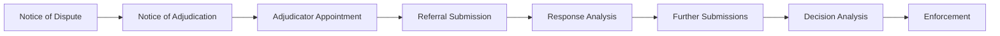

# Adjudication

## What this is

Adjudication support for managing a formal dispute through the standard UK
construction adjudication process, from notice of dispute through to
enforcement.

## Who can use it

Super Admin and Admin create and progress adjudication cases. Client users can
view them. This module can be hidden entirely for your organisation by a Super
Admin — if you do not see **Adjudication** in your project sidebar, it has been
switched off, not removed.

## Where to find it

Project → **Adjudication**.

## Creating a case

1. Select **Create Case**.
2. Enter a **Title**, **Dispute Type** (Payment, Variation, Defects, Extension
   of Time, or Other), **Claimant Name**, and **Respondent Name**.
3. Enter the **Claim Amount** and **Currency**.
4. Link a related **Contract**, **Payment Application**, or **Variation**, if
   relevant.
5. Enter a **Summary** and any known **Key Dates**.
6. Save.

## The 8-step workflow

Each case tracks progress through eight steps:

Each step shows its status (current, completed, upcoming, or skipped), a due
date, and, once complete, who completed it and when. Use **Advance Step** to
mark the current step complete and move to the next.

## Documents and deadlines

- **Documents panel** — add a document either by uploading a real file, or by
  creating a draft record (a placeholder entry without a file, useful for
  tracking something not yet ready to upload).
- **Deadlines panel** — add deadlines (Notice, Referral, Response, Decision,
  Enforcement, or Custom), each showing whether they are upcoming, due soon,
  overdue, or completed. Mark a deadline complete or delete it as needed.

## Case actions

- **Generate Prompt** — produces AI-assistant prompt text related to the case.
- **Advance Step** — moves the case to its next step.
- **Close Case** / **Archive** — close a finished case, or archive it to move
  it out of your active list.

!!! note "AI Assistant panel is not yet available"
    The case detail page includes an "AI Assistant" panel with buttons such as
    "Summarise Dispute" and "Draft Notice of Adjudication." This panel is
    labelled **Coming soon** and its buttons are not currently functional.

## Related

- [Payment Applications](../commercial/payment-applications.md)
- [Variations](../variations/overview.md)
