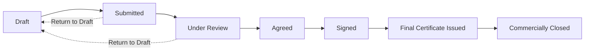

# Final Account

## What this is

The Final Account brings together the total financial position of a contract
or trade package at the end of the works: the adjusted contract sum, all
variations, loss and expense, retention, and what remains due.

## Who can use it

Super Admin and Admin progress a Final Account. Client users can view it.

## Where to find it

Project → **Commercial** → **Final Account** tab. There is one Final Account
per main contract or trade package.

## Before you begin

A Final Account is normally started once the bulk of variations, loss and
expense, and payment applications for a contract or trade package are settled.
If none exists yet, select **Create Final Account**.

## The lifecycle

| Status | What you can do from here |
|---|---|
| Draft | Fully editable. Add/edit/delete line items. |
| Submitted | Start Review, or Return to Draft. |
| Under Review | Agree Final Account, or Return to Draft. |
| Agreed | Sign. Financial values are now locked to an agreed snapshot. |
| Signed | Issue Final Certificate. |
| Final Certificate Issued | Commercially Close. |
| Commercially Closed | No further actions — the Final Account is complete. |

!!! warning "Agreeing locks the figures"
    Selecting **Agree Final Account** locks all financial values into an
    agreed snapshot. SureSign warns that this cannot be undone. From this point,
    later changes to payment applications, variations, or retention will not
    change the agreed Final Account figures — the badge changes from "Live
    Values" to "Agreed Snapshot."

!!! important "Issuing the Final Certificate starts the dispute window"
    Selecting **Issue Final Certificate** sets a 28-day dispute window (shown as
    "JCT dispute window expires: {date}") and unlocks the second half of
    retention for release. Confirm this is the right moment before issuing.

## What you will see

- A visual status stepper across the top: Draft → Submitted → Review → Agreed →
  Signed → Certificate → Closed.
- A **Commercial Summary**: Original Contract Sum, Approved Variations, Loss &
  Expense, Dayworks, Provisional Sums, Prime Cost Sums, Contra Charges, Other
  Adjustments, Adjusted Contract Sum, Certified To Date, Paid To Date, Retention
  Held, Retention Released, Retention Outstanding, and Final Balance Due.
- **Line items** grouped by category (Contract Sum, Approved Variations, Loss &
  Expense, Dayworks, Provisional/Prime Cost Sums, Contra Charges, Deductions,
  Other), each with a running total. Items can be added, edited, or deleted
  while the account is not locked. Items automatically added from other records
  are tagged "Auto" and cannot be deleted if they belong to the contract sum
  category.

## Generated documents

- **Generate Statement** — produces a statement of account (labelled "Generate
  Draft Statement" before the account is agreed).
- **Generate Final Certificate** — available once the status reaches Final
  Certificate Issued or Commercially Closed.
- Each generated document has a **Download** button.

## Related

- [Payment Applications](payment-applications.md)
- [Retention](retention.md)
- [Variations](../variations/overview.md)
