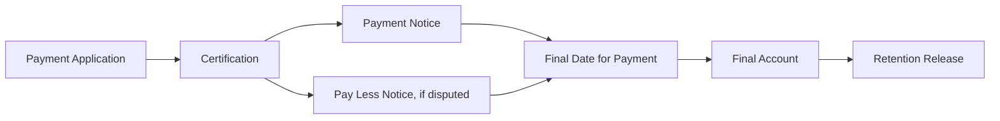

# Commercial

## What this is

Commercial covers the money side of a project: payment applications, payment
notices, pay less notices, retention, and final accounts. Commercial records
are raised against either a project's main contract or a specific trade
package.

## Who can use it

Super Admin and Admin can create and progress commercial records. Client users
can view commercial records for their own organisation's projects.

## Where to find it

Open a project and select **Commercial** from the project sidebar. It is
organised into tabs, including Payment Applications, Variations, Retention, and
Final Account.

## How the commercial chain connects

## In this section

- [Payment Applications](payment-applications.md)
- [Application Valuations](application-valuations.md)
- [Payment Notices](payment-notices.md)
- [Pay Less Notices](pay-less-notices.md)
- [Retention](retention.md)
- [Final Account](final-account.md)
- [Generated Documents](generated-documents.md)

## Common mistakes to avoid

- Certifying a payment application before checking the calculated totals
  against the actual valuation.
- Issuing a pay less notice after its deadline has passed — SureSign will show
  the notice as late, but it does not stop you issuing it; check your
  contract's requirements first.

## What to do next

Start with [Payment Applications](payment-applications.md) if you are new to
this area.
