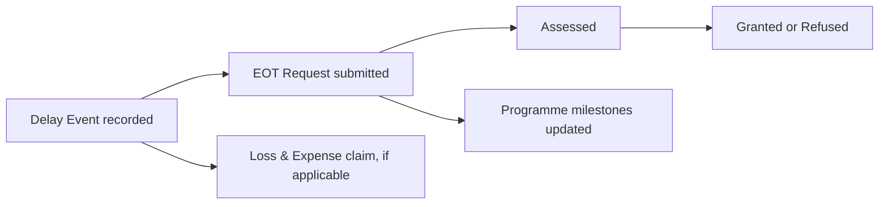

# Delay and Extension of Time

## What this is

This section covers three related record types, each on its own tab under
**Delay & EOT**: Delay Events, Extension of Time (EOT) Requests, and Loss &
Expense claims.

## Who can use it

Super Admin and Admin create and progress these records. Client users can view
them.

## Where to find it

Project → **Delay & EOT**.

## In this section

- [Delay Events](delay-events.md)
- [Extension of Time](extension-of-time.md)

## How they connect

A delay event is usually the starting point: something happens on site that
causes delay. From it, you may raise an EOT request (asking for more time) and,
separately, a loss and expense claim (asking for the cost impact).

## Related

- [Programme](../programme/overview.md)
- [Variations](../variations/overview.md) — a delay may also relate to a
  variation
- [Risks](../risks/overview.md)
