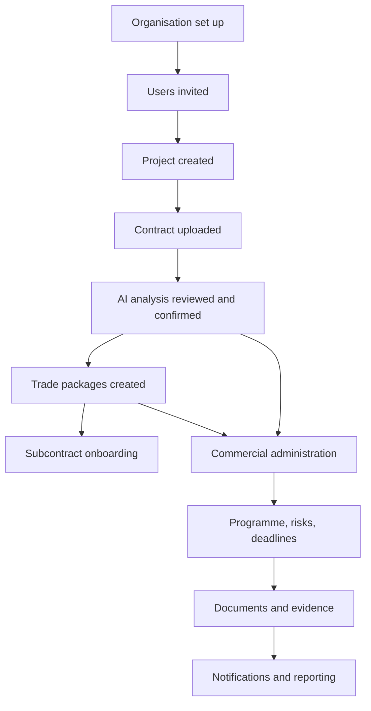

# Welcome to the SureSign User Guide

This documentation explains how to use SureSign throughout the lifecycle of a
construction project, from project setup and contract administration through
commercial management, compliance, collaboration, and project closeout.

Documentation relating to platform administration, deployment, infrastructure,
and internal operations is intentionally maintained separately.

This guide is written for the people who use SureSign every day: contract
administrators, quantity surveyors, project managers, commercial managers,
site managers, consultants, and subcontractors.

!!! note "Who this guide is for"
    This is a user manual, not a technical reference. It explains what you see
    on screen, what you need before you start a task, how to complete it, and
    what happens next.

## What SureSign helps you do

- Set up and administer construction **projects**, each with its own contract,
  team, and document library.
- Upload a contract and use **AI analysis** to extract key terms, dates, and
  obligations for review and confirmation, saving manual re-keying.
- Break a project into **trade packages** (subcontract work packages) and manage
  subcontractor onboarding, documents, and commercial records for each one.
- Run the full **commercial cycle**: payment applications, payment notices, pay
  less notices, retention, and final accounts.
- Track **programme milestones**, **variations**, **delay events**, and
  **extensions of time**.
- Manage day-to-day site administration: **RFIs**, **meetings**, **site reports**,
  **QA reports**, and **snagging**.
- Keep a **risk register** and **delivery documents** register per project or
  trade package.
- Store, preview, and download **documents**, with system-generated PDFs and
  Excel workbooks for commercial records.
- Stay on top of deadlines with the project **calendar** and **notifications**.

## How it all connects

Every project sits inside your organisation ("company" in SureSign). Contracts,
trade packages, and all operational records belong to a project. Commercial
records (payment applications, notices, final accounts) are raised against
either the main contract or a trade package. Documents, notifications, and the
calendar pull information from across all of these so you always know what is
outstanding.

## Where to start

- **[Getting Started](getting-started/overview.md)**
  Sign in, understand your dashboard, and complete your first-day checklist.

- **[Roles](roles/overview.md)**
  What your account can see and do.

- **[Projects](projects/overview.md)**
  Create and navigate a project workspace.

- **[Contracts](contracts/overview.md)**
  Upload a contract and use AI analysis.

- **[Commercial](commercial/overview.md)**
  Payment applications, notices, retention, and final accounts.

- **[Workflows](workflows/index.md)**
  Step-by-step guides for the most common end-to-end tasks.

- **[AI in SureSign](ai/overview.md)**
  What AI analysis does, and its limitations.

- **[Troubleshooting](troubleshooting/index.md)**
  Fixes for common sign-in, upload, and access problems.

- **[Glossary and FAQ](reference/glossary.md)**
  Definitions and answers to common questions.

!!! important "AI results are suggestions, not decisions"
    Anywhere SureSign uses AI, such as contract analysis, the results are
    extracted suggestions for a person to review. AI output only becomes
    authoritative in SureSign once a user has reviewed and confirmed it. AI
    output is not a legal or contractual determination.
