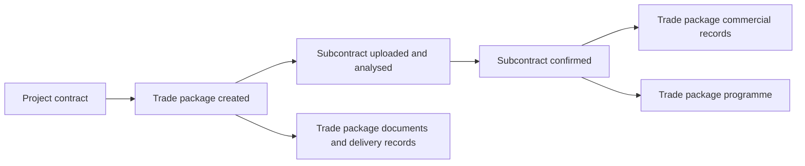

# Trade Packages

## What this is

A trade package represents a distinct piece of work let to a subcontractor
within a project — for example Groundworks, Brickwork, or M&E. Each trade
package has its own reference, documents, commercial records, and programme,
separate from (but connected to) the project's main contract.

## Who can use it

Super Admin and Admin can create and manage trade packages. Client users can
view trade packages belonging to their own organisation's projects.

## Where to find it

Trade packages are created and opened from within a project, typically from the
Contracts or Commercial area.

## How trade packages connect to everything else

## In this section

- [Creating a Trade Package](creating-a-trade-package.md)
- [Subcontract Onboarding](subcontract-onboarding.md)
- [Trade Package Workspace](workspace.md)

## Related modules

- [Contracts](../contracts/overview.md)
- [Commercial](../commercial/overview.md) — payment applications can be raised
  against a trade package independently of the main contract.
- [AI: Subcontract Analysis](../ai/subcontract-analysis.md)

## Common mistakes to avoid

- Creating a custom trade package with a name so similar to a standard package
  that its auto-generated reference code collides — SureSign will append a
  suffix (for example `-01`) to keep references unique, but a clearer, more
  distinct name avoids confusion later.
