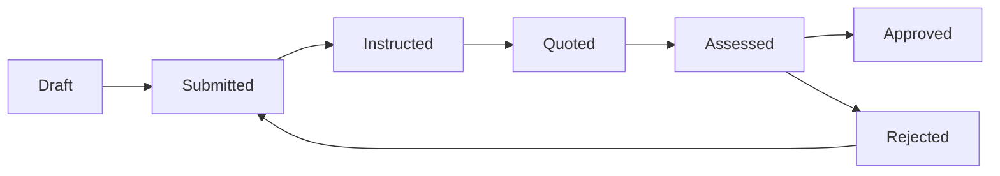

# Variations

## What this is

A variation is a change to the contracted works: an addition, omission,
substitution, or other instructed change, tracked from instruction through to
agreed value.

## Who can use it

Any authenticated user with access to the project — including the Client
role, not just Admin/Super Admin — can create and progress variations.

## Where to find it

Project → **Variations**, or the Variations tab within **Commercial**.

## Before you begin

Have ready: which contract the variation relates to, a description of the
change, and, if known, an initial quoted amount and any programme impact.

## How to create a variation

1. Select **Create Variation**.
2. Choose the **Contract**.
3. Enter a **Title** and **Description**.
4. Choose a **Type** (for example addition, omission, substitution,
   provisional sum, daywork).
5. Enter the **Variation Date**.
6. Enter the **Instruction Method** and, if known, a **Quoted Amount**.
7. Choose a **Valuation Method**.
8. Enter any **Programme Impact (days)**.
9. Save.

## Status lifecycle

| Status | Meaning | Set by |
|---|---|---|
| Draft | Being prepared. | Created this way |
| Submitted | Formally raised. | Submit |
| Instructed | Instructed to proceed. | Instruct |
| Quoted | A price has been submitted. | Quote (requires a Quoted Amount) |
| Assessed | The quote has been reviewed. | Assess |
| Approved | Agreed — **final**. | Approve |
| Rejected | Not agreed. | Reject (requires a rejection reason) |

A rejected variation can be **resubmitted**, returning it to Submitted so the
process can run again.

## Editing after approval

Once approved, a variation's agreed amount cannot be changed through a normal
edit — a formal revision process for approved variations is not currently
available. If a genuine change is needed after approval, discuss with your
Admin how your organisation wants to handle it (for example, raising a further
variation).

## What happens after each step

- **Submit / Instruct / Quote / Assess / Approve / Reject / Resubmit** each
  send a notification to relevant users, and are recorded in the project's
  activity feed.
- An **approved** variation's agreed amount can be included in a payment
  application's valuation and in the [Final Account](../commercial/final-account.md).

## Related modules

- [Payment Applications](../commercial/payment-applications.md)
- [Final Account](../commercial/final-account.md)
- [Glossary](../reference/glossary.md)
- [Programme](../programme/overview.md) — for programme impact
- [Risks](../risks/overview.md)

## Common mistakes to avoid

- Approving a variation before its quoted amount has actually been agreed —
  once approved, the amount is treated as final for that variation.
- Leaving a rejected variation sitting without resubmitting or replacing it if
  the underlying change is still needed.

## What to do next

Generate the **Variation Order** PDF from the variation once instructed or
approved, and check it is included where relevant in a payment application or
the Final Account.

## Drawing Locations

A variation can be connected to a drawing location, but only by linking an
*existing* variation — select **Link Existing** from that location's
marker in the [Drawing Viewer](../drawings/viewing-a-drawing.md#linking-existing-records)
and choose it. There is no way to create a new variation directly from a
drawing location (unlike Snags, RFIs, and QA Reports) — a variation's own
commercial workflow always starts from its normal creation screen.

If a variation has been linked to a location on a Drawing, a **Drawing
Locations** section on the variation shows every drawing location it's
linked from, with an **Open Drawing** action that jumps straight to the
correct drawing, revision, and page.
